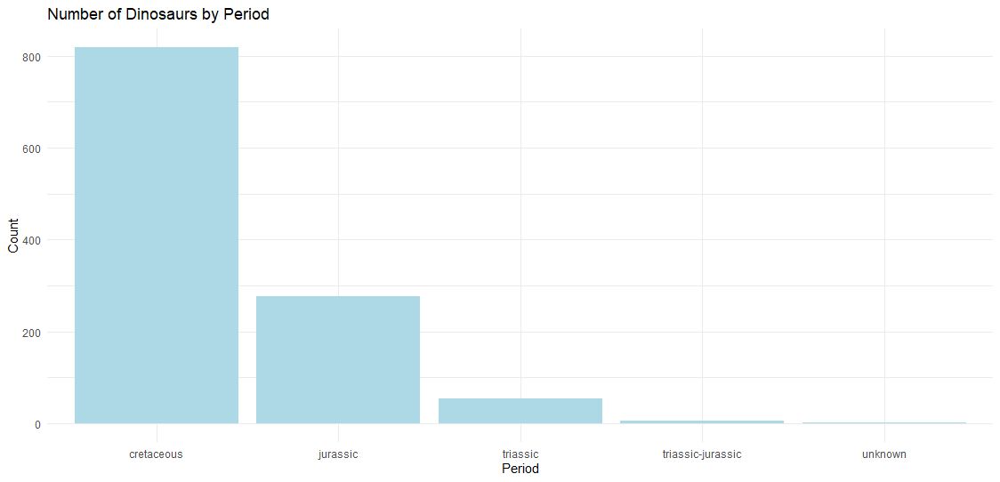
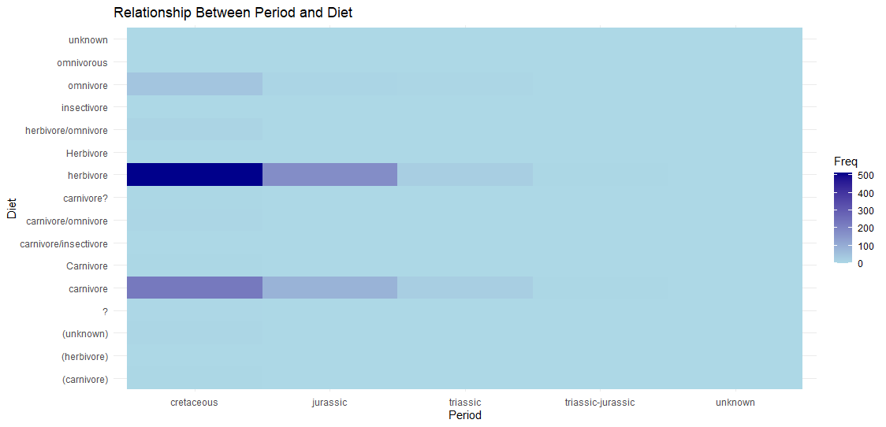
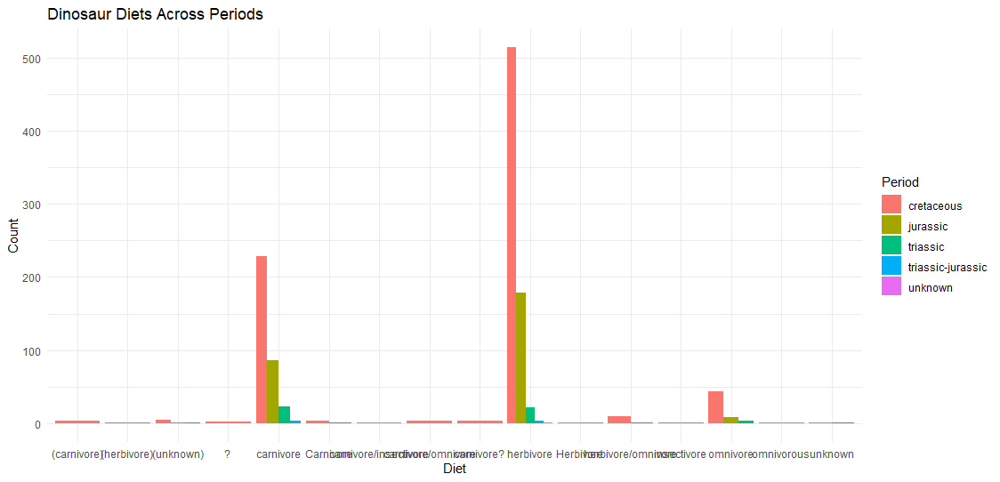

# Dinosaur Dataset Analysis

## Project Overview
This project analyzes a dataset of dinosaurs, exploring their Period, Diet, and Country of discovery. The goal is to clean the data, standardize values, and create visualizations to uncover patterns in R, using Rstudio.

## Dataset
- **File:** `dinosaur.csv`
- **Columns:**
  - `Name`: Dinosaur's name
  - `Period`: Time period (e.g., Jurassic, Cretaceous)
  - `Diet`: Type of diet (herbivore, carnivore, etc.)
  - `Country`: Location where the fossil was found

## Packages Used
Make sure to install these packages first (only once):

```r
install.packages(c("dplyr", "tidyr", "ggplot2", "scales", "lubridate", "stringr", "data.table", "skimr", "maps"))
```

Then load them in the script:

```r
library(dplyr)
library(tidyr)
library(ggplot2)
library(scales)
library(lubridate)
library(stringr)
library(data.table)
library(skimr)
library(maps)
```

## Data Cleaning Steps
- **Removed extra spaces** in the Period and Country columns
- **Standardized text** to lowercase
- **Fixed inconsistent values** (e.g., merging "early-late cretaceous" into "cretaceous")
- **Checked for missing values** and handled unknown data

##  Visualizations

###  Number of Dinosaurs by Period
```r
ggplot(data, aes(x = Period)) +
    geom_bar(fill = "lightblue") +
    labs(title = "Number of Dinosaurs by Period", x = "Period", y = "Count") +
    theme_minimal()
```


###  Relationship Between Period and Diet
```r
period_diet_table <- table(data$Period, data$Diet)

ggplot(as.data.frame(period_diet_table), aes(x = Var1, y = Var2, fill = Freq)) +
    geom_tile() +
    scale_fill_gradient(low = "lightblue", high = "darkblue") +
    labs(title = "Relationship Between Period and Diet", x = "Period", y = "Diet") +
    theme_minimal()
```


###  Dinosaur Diets Across Periods
```r
ggplot(data, aes(x = Diet, fill = Period)) +
    geom_bar(position = "dodge") +
    labs(title = "Dinosaur Diets Across Periods", x = "Diet", y = "Count") +
    theme_minimal()
```


## How to Run
1. **Clone the repository**:
   ```bash
   git clone https://github.com/juliaaviee/Dino-Analysis.git
   ```
2. **Run the R script:**
   ```bash
   Rscript dinosaur_analysis.R
   ```
3. **Check the `images/` folder** for the saved visualizations.

💡 **Made with R and 🦖 dinosaurs!**
